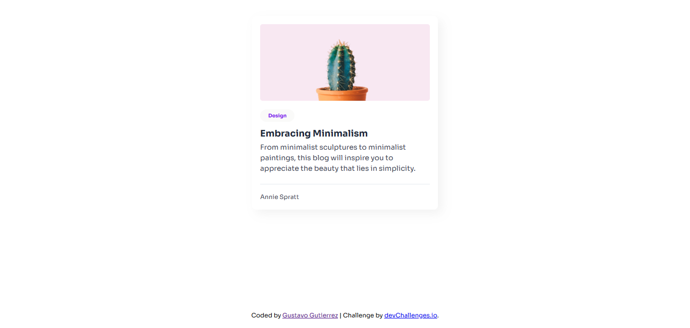

<!-- Please update value in the {}  -->

<h1 align="center">Minimal Blog Card | devChallenges</h1>

   Solution for a challenge <a href="https://devchallenges.io/challenge/minimal-blog-card" target="_blank">Minimal Blog Card</a> from <a href="http://devchallenges.io" target="_blank">devChallenges.io</a>.

  <h3>
    <a href="https://gustavo2023.github.io/minimal-blog-card/">
      Demo
    </a>
     | 
    <a href="https://devchallenges.io/solution/28974">
      Solution
    </a>
     | 
    <a href="https://devchallenges.io/challenge/minimal-blog-card">
      Challenge
    </a>
  </h3>

<!-- TABLE OF CONTENTS -->

## Table of Contents

- [Overview](#overview)
  - [What I learned](#what-i-learned)
- [Built with](#built-with)
- [Features](#features)

<!-- OVERVIEW -->

## Overview

### What I learned

Learned about different tags and how to better use semantic HTML to make a better structure for the card.

### Built with

- Semantic HTML5 markup
- CSS custom properties
- Flexbox

## Features

Simple blog card with a category tag, a short text and the author.

This application/site was created as a submission to a [DevChallenges](https://devchallenges.io/challenges-dashboard) challenge.

## Author

- GitHub [@gustavo2023](https://github.com/gustavo2023)
